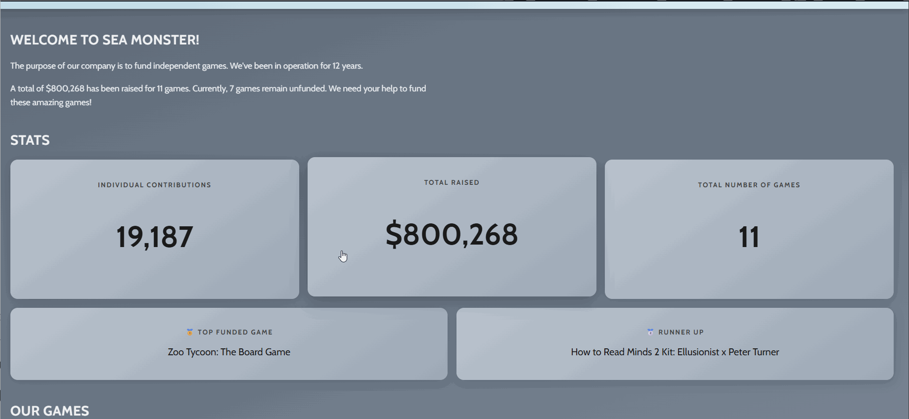

# WEB102 Prework - Sea Monster Crowdfunding

Submitted by: **Ziona Agyemang**

**Sea Monster Crowdfunding** is a website for the company Sea Monster Crowdfunding that displays information about the games they have funded.

Time spent: **3-4 hours**

## Required Features

The following **required** functionality is completed:

* [x] The introduction section explains the background of the company and how many games remain unfunded.
* [x] The Stats section includes information about the total contributions and dollars raised as well as the top two most funded games.
* [x] The Our Games section initially displays all games funded by Sea Monster Crowdfunding
* [x] The Our Games section has three buttons that allow the user to display only unfunded games, only funded games, or all games.

The following **optional** features are implemented:

* [x] Made the site responsive so the game cards and stats section stack cleanly on smaller screens without breaking the layout.
* [x] Styled the filter buttons with a clean outlined design and smooth hover transitions to match a modern, minimal aesthetic.
* [x] Added active button state so the currently selected filter stays visually highlighted until a new one is chosen.

## Video Walkthrough

Here's a walkthrough of implemented features:

GIF created with LiceCap

## Notes

A few challenges came up during the build. The `games.js` data was stored as a template string instead of an actual array, which caused every property to come back as `undefined` and took some debugging to track down. Getting the `reduce()` calls right for the stats section was also a bit tricky since the accumulator pattern takes a second to click. Setting up the filter buttons to properly clear the container before re-rendering was another spot that needed some extra attention to get working smoothly.

## License

    Copyright 2026 Ziona Agyemang

    Licensed under the Apache License, Version 2.0 (the "License");
    you may not use this file except in compliance with the License.
    You may obtain a copy of the License at

        http://www.apache.org/licenses/LICENSE-2.0

    Unless required by applicable law or agreed to in writing, software
    distributed under the License is distributed on an "AS IS" BASIS,
    WITHOUT WARRANTIES OR CONDITIONS OF ANY KIND, either express or implied.
    See the License for the specific language governing permissions and
    limitations under the License.
